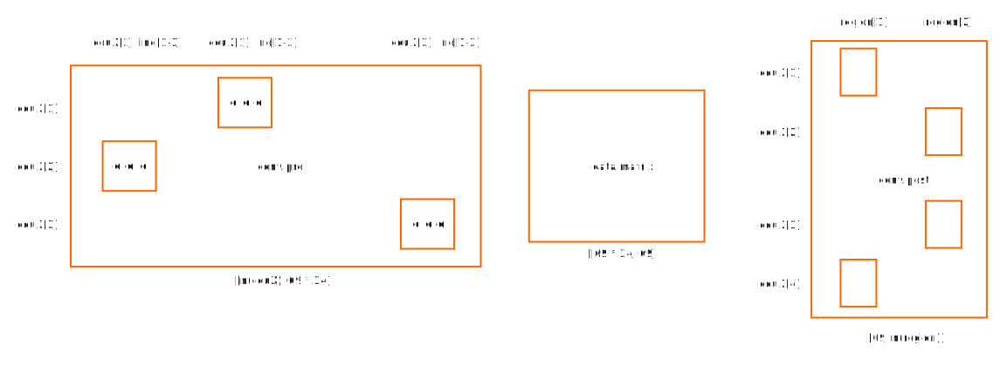
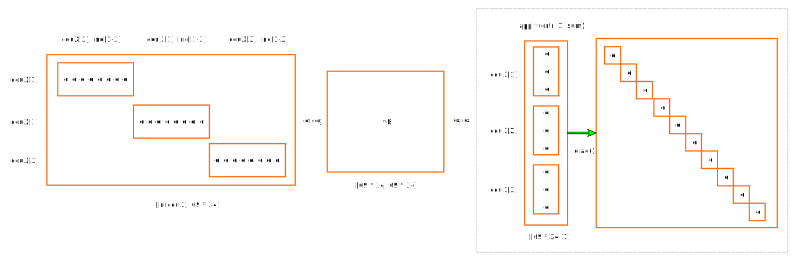

# ICIO Dashboard

Dashboards 
<!-- rmarkdown::render(file.path(dbpath, "GitHub", "desk", "inst", "industry", "tools", "help", "icioDash.md")) -->

## GRTRnoDomestic

This uses the general structure where the cetral `data.matrix` is replaced with GRTR (with domestic elements set to zero)

## VAsource

Here, `data.matrix` is a combination of three elements:

1. `grtr.sum = apply(grtr, 1, sum)`: a vector with total exports by country and industry
2. `vB %*% diag(grtr.sum)`: a matrix with value added by source country and industry (this is actually calculated as `t(t(vB) * grtr.sum)` for better performance)
3. `conv.cou`: a converter to aggregate results over all indutries for 69 economies

&copy; OECD (2015)
