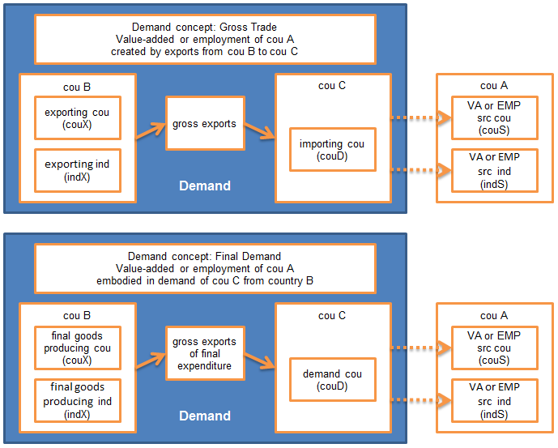

Domestic Value-Added embodied in Foreign Final Domestic Demand, by importing country and exporting industry (in USD)

#### Flow Diagram

Value-Added embodied in Foreign Final Domestic Demand shows how industries export value both through direct final exports and via indirect exports of intermediates through other countries to foreign final consumers (households, charities, government, and as investment). They reflect how industries (upstream in a value-chain) are connected to consumers in other countries, even where no direct trade relationship exists. The indicator illustrates therefore the full upstream impact of final demand in foreign markets to domestic output. It can most readily be interpreted as 'exports of value-added'.

&copy; OECD (2014)
