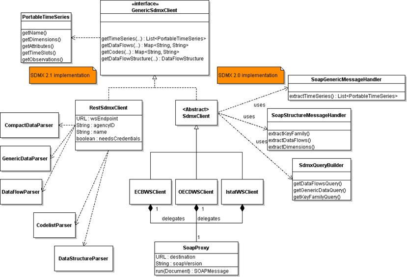

This application provides a front-end to the __RJSDMX__ functions created
by Attilio Mattiocco and Diana Nicoletti at Bank of Italy.

These functions call a java library and convert the output into R
timeseries using the __zoo__ package. The library can be reused in
other statistical tools (e.g. MATLAB, Excel, SAS).

### Interface Elements

#### User Inputs

__SDMX Query:__ The query combines selected dimension codes. It can be
edited directly. Edits are overridden by the SDMX Query Builder

__Submit Query:__ Update values from provider

__Download CSV:__ Download zipped values in flat file format

#### SDMX Query Builder

__Provider:__ Select among ECB, OECD, EUROSTAT, ISTAT, IMF

#### Output Tabs

__DataTables:__ Display the values in an interactive table for sorting
and filtering

__Plots:__ Draw a line chart with the selected time series. Shares are
suitable for comparison of multiple series at once (e.g. PC_TOT,
Percentage share in total).

NOTE: only one __FREQ__ code be selected at the same time

### RJSDMX Package

#### R Functions

`getProviders()`: retrieve list of stored providers

`getFlows()`: retrieve data flows for selected provider

`getDimensions()`: retrieve dimensions for selected data flow

`getCodes()`: retrieve codes of the selected dimension

### The SDMX Java Library

The diagram shows that a __legacy__ SDMX2.0 __SOAP__ world and a __new__ SDMX2.1
__REST__ world exist in parallel. The 2.0 implementation is gradually
abandonned as ECB, BIS and Eurostat already provide 2.1 Rest web
services. The transition will complete soon, since the 2.0 version is
much less standard than the 2.1 and needs many little adjustments for
each data provider. In the 2.1 version instead there is no need for
specialized clients, and the very same client works for every provider.

For more information, please contact the authors of the package and
the java library:

Attilio Mattiocco
[attilio.mattiocco@bancaditalia.it](mailto:attilio.mattiocco@bancaditalia.it)
and
Diana Nicoletti
[diana.nicoletti@bancaditalia.it](mailto:diana.nicoletti@bancaditalia.it)

---

&copy; OECD (2014)
