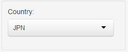
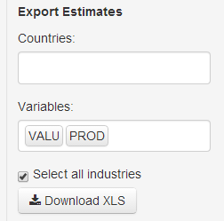
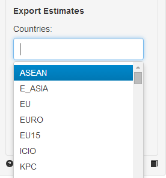
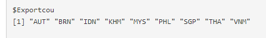

## Summary

  - combine data from National Accounts with Structural Business
    Statistics
  - extend main source with one or more secondary sources
  - add distribution from more detailed source
  - hierarchical benchmarking to main source

A short tutorial can be found at the end of this helpfile

## Data Dimensions

__Country__ 3-digit ISO code

__Variable__ STAN variable code

__Industry__ STAN ISIC Rev. 3 industry code(s)

## Data Representation

### Units

__Monetary variables__ million US Dollars

__EMP__ persons

### Tables

__Data__ Pivoted table of values for selected combination of country,
variable and industry dimensions by source with years in columns.

__Calculation__ If more than one variable or industry is selected, the
ratio between the two variables or industries is calculated by
default. Alternatively, the difference can be calculated.

### DataTables

__Sources__ Selected sources for estimation as stored in array
`stani3Estimate.rda`.

__Hierarchy__ Hierarchy of industry lists

### Plots

__Lines__ Line plot: multiple sources, one industry

__Bars__ Bar plot: one source, multiple industries

## Estimation

### Preview

The preview is limited in a way that it only allows to perform
estimations for one industry at a time. Therefore, the results in the
preview are not adjusted. Source information is read from and save in
the array `stani3Estimate.rda`.

__Extend__ Extend main source with growth rates from secondary source

__Detail__ Apply distribution from secondary source to main source, preserving
existing detail in the main source

### Export

By default, the export function performs *Extend* and *Detail*
estimation for all industries and adjusts the results. Depending on
the number of secondary sources for each combination of dimensions,
the procedure can take considerable time to finish (one minute per
country).

__Countries__ Select the regions or countries for generation of estimates

__Variables__ Select variables for generation of estimates

## Tutorial

Select country

Activate the two fields "Extend series" and "Applied detailed industry share"
the currently defined combination of sources will be inserted

click "Download XLS" to produce estimates

  - results for additional countries can be produced by selecting them
in the export section
  - this can take a while depending on the number of selected countries
  - when ready, a zip folder with all results will be downloaded

the vector of countries for exporting can be seen in the "Plots" tab
below the plot

&copy; OECD (2014)
