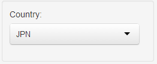
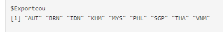

## Summary

  - combine data from National Accounts with Structural Business
    Statistics
  - extend main source with one or more secondary sources
  - add distribution from more detailed source
  - hierarchical benchmarking to main source

A short tutorial can be found at the end of this helpfile

## Interface Controls

### Tables

__Data__ Pivoted table of values for selected combination of country,
variable and industry dimensions by source with years in columns.

__Calculation__ If more than one variable or industry is selected, the
ratio between the two variables or industries is calculated by
default. Alternatively, the difference can be calculated.

### DataTables

__Sources__ Selected sources for estimation as stored in array
`stani3Estimate.rda`.

__Hierarchy__ Hierarchy of industry lists

### Plots

__Lines__ Line plot: multiple sources, one industry

__Bars__ Bar plot: one source, multiple industries

## Data

### Dimensions

__Country__ 3-digit ISO code

__Variable__ STAN variable code

__Industry__ STAN ISIC Rev. 4 industry code(s)

### Units

__Monetary variables__ million US Dollars

__EMP__ persons

### Harmonized Sources

#### SNA 2010

__STDSNAi4__ Data submitted to OECD STD National Accounts Division in reply to SNA questionnaire

__EUANAMA10R2__ Eurostat National Accounts ESA 2010

__UNDATA206SNA08__ United Nations Main Aggregates and Detailed Tables, ISIC Rev. 4 SNA 2008

#### SNA 1993

__EUANAMAR2__ Eurostat National Accounts SNA 1993

__NSONAPATCH__ Data collected and harmonised from National Accounts published by National Statistical Offices not included in STAN

__STANi3__ OECD STAN Database ISIC Rev. 3 converted to ISIC Rev. 4 (latest year: 2009) 

__STANi4__ Provisional OECD STAN Database ISIC Rev. 4 (SNA 1993)

__UNDATA206SNA93__ United Nations Main Aggregates and Detailed Tables, ISIC Rev. 4 SNA 1993

## Estimation

### Preview

The preview is limited in a way that it only allows to perform
estimations for one industry at a time. Therefore, the results in the
preview are not adjusted. Source information is read from and save in
the array `stani3Estimate_srcarray.rda`.

__Extend__ Extend main source with growth rates from secondary source

__Detail__ Apply distribution from secondary source to main source, preserving
existing detail in the main source

### Export

By default, the export function performs *Extend* and *Detail*
estimation for __all industries__ and adjusts the results. Depending on
the number of secondary sources for each combination of dimensions,
the procedure can take considerable time to finish (one minute per
country).

__Export countries__ Select the regions or countries to include in results

__Export variables__ Select variables to include in results

__Update results__ Check to run estimations and save updated results to
disk. Henceforth, latest results can be exported from object without
re-running the estimation procedure.

__Export flat file (csv)__ create long form table including results for all
available combinations selected for export

__Export Excel file(s)__ create Excel file for each selected country
with one sheet per variable

__Include calculations__ perform calculations with exported
variables. Currently defined are:

  - `VALUshPROD` = `VALU / PROD * 100`
  - `LABRshVALU` = `LABR / VALU * 100`
  - `VALUperEMPN` = `VALU / EMPN * 10^6`
  - `VALUshCTOTAL` = `VALU / VALU_CTOTAL * 100`

---

## Application Architecture

### Add industry aggregate to harmonised sources

- modify `indAggregate` function of `stan` package: add to `list.agg.add`
- re-install `stan` package
- click "export source data"
- when done, click "reload harmonized data"

### Edit system files

__Min and max year__ Data points to be removed from sources (by country and variable) can be specified in the init file `stani3Estimate_drop.csv`

__Custom industry conversion__ Industries can be remapped or calculated from existing industries, either for all countries (empty string) or for specific countries (iso-3 country coded)

---

## Tutorial

Select country

Activate the two fields "Extend series" and "Applied detailed industry share"
the currently defined combination of sources will be inserted

click "Download XLS" to produce estimates

  - results for additional countries can be produced by selecting them
in the export section
  - this can take a while depending on the number of selected countries
  - when ready, a zip folder with all results will be downloaded

the vector of countries for exporting can be seen in the "Plots" tab
below the plot

&copy; OECD (2014)
